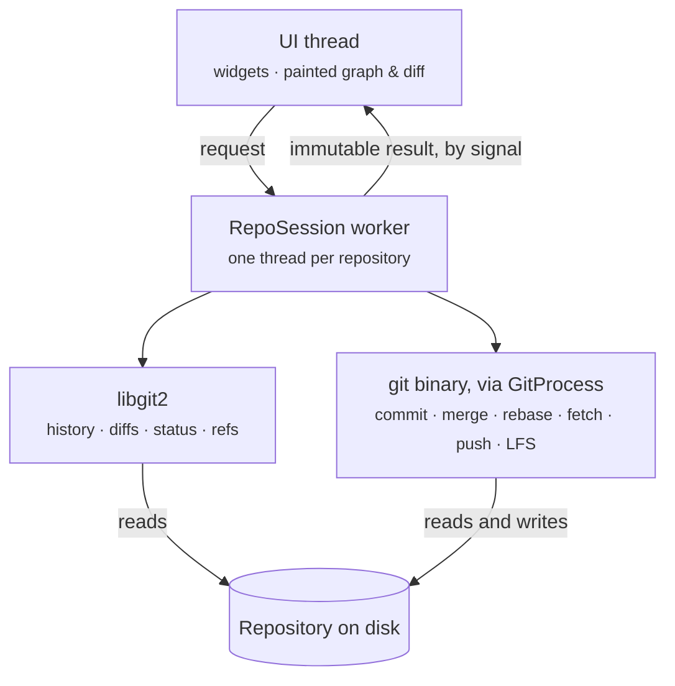

# Gity — architecture decisions

**Status:** Accepted · **Last revised:** 2026-09-29

Gity is a desktop Git client — a dense, fast commit graph, staging by hunk and by line, merge,
rebase and stash, LFS locks, and submodules opened as repositories of their own — running natively
on Linux, macOS and Windows. Open source under the MIT licence.

This file records the decisions that shape the code, one ADR (architecture decision record) each,
with the reasons for them and what they cost. Where the code has not yet caught up with a decision,
the ADR says so. ADR numbers are never reused: 008 and 009 described a Unity-engine integration that
was built and then removed when Gity became a general Git client, and they are gone from this file.

---

## Contents

- [Context and constraints](#context-and-constraints)
- [Measurements](#measurements)
- [Decisions at a glance](#decisions-at-a-glance)
- [ADR-001 — Platform: C++20 and Qt 6](#adr-001--platform-c20-and-qt-6)
- [ADR-002 — UI layer: Qt Widgets, with the hot views painted](#adr-002--ui-layer-qt-widgets-with-the-hot-views-painted)
- [ADR-003 — Git backend: libgit2 reads, the git binary writes](#adr-003--git-backend-libgit2-reads-the-git-binary-writes)
- [ADR-004 — Concurrency: one worker thread per repository](#adr-004--concurrency-one-worker-thread-per-repository)
- [ADR-005 — Commit-graph algorithm](#adr-005--commit-graph-algorithm)
- [ADR-006 — Build and dependencies](#adr-006--build-and-dependencies)
- [ADR-007 — Packaging and distribution](#adr-007--packaging-and-distribution)
- [ADR-010 — Signing in through a browser](#adr-010--signing-in-through-a-browser)
- [ADR-011 — Safety net: undo, previews and a visible command log](#adr-011--safety-net-undo-previews-and-a-visible-command-log)
- [Module boundaries](#module-boundaries)
- [Licensing](#licensing)
- [Risks](#risks)
- [Open questions](#open-questions)
- [How it was built](#how-it-was-built)

---

## Context and constraints

A dense, fast, keyboard-friendly window over one repository, with the commit graph at its centre,
interactive staging by hunk and by line, and first-class rebase, merge and stash — running natively
on Linux as well as macOS and Windows. Linux comes first, because it is the platform polished Git
GUIs most often leave out.

Three facts shape every decision below:

1. **C and C++ are the author's strength**, not web stacks or QML.
2. **The application lives or dies on one screen**: a virtualized list of up to a million commits
   with a custom-painted graph, scrolling smoothly while diffs load underneath it.
3. **It must never regress the user's own Git setup.** People arrive with hooks, LFS, credential
   helpers, signing and custom merge drivers already configured; a client that bypasses any of them
   loses its users on the first day.

### What sets it apart

* **Nothing is lost.** Destructive operations are undoable, from snapshots stored as ordinary git
  objects (ADR-011).
* **You see what will happen first.** Pull, merge, rebase and push are previewed, and force push is
  only ever with a lease (ADR-011).
* **Git is never hidden.** Every command Gity runs is logged as you could type it, and every button
  names the command behind it (ADR-011).
* **Submodules are repositories**, opened in their own tab rather than shown as a line in a list.
* **No credential of its own.** Every token lives in the credential helper the user already chose
  (ADR-010).
* **Linux as a first-class platform**, not an afterthought.

### Non-functional targets

| Dimension | Target | Reference workload |
|---|---|---|
| Cold start to empty window | < 400 ms | Warm page cache, mid-range laptop |
| Repository open to first painted graph rows | < 1 s | 1M commits, 80k files |
| Graph scrolling | Sustained 60 fps | Same |
| Resident memory, large repository open | < 350 MB | Same |
| Diff render for a 5k-line file | < 120 ms from click | Side by side |
| The user's existing Git setup | Zero regressions: hooks, LFS, credential helpers, signing, custom merge drivers | Corporate SSH + LFS + pre-commit |

The last row is not a nicety. It decides ADR-003, and it is where most Git GUIs lose their users.

---

## Measurements

Taken before the UI existed, with `gity-bench` (`bench/`), to test the riskiest assumptions while
they were still cheap to change. Two workloads: a real, private production game project (13,006
commits, 12,482 tracked files, 2.6 GB `.git`, clean working copy) and 230,000 synthetic commits
with merge structure from `tools/make-bench-repo.sh`.

| Operation | Real (13k) | Synthetic (230k) | Extrapolated to 1M |
|---|---|---|---|
| History walk, cold | 53 ms | 830 ms | ~3.6 s |
| History walk, warm | 12 ms | 280 ms | ~1.2 s |
| Lane assignment (ADR-005) | 0.38 ms, 14 lanes at most | 1.6 ms | ~7 ms |
| Graph memory | 61 B per commit | 29 B per commit | ~60 MB on real branching |
| `status`, libgit2 | 33 ms | 0.7 ms | |
| `status`, git CLI | 13 ms | 3.6 ms | |
| Peak resident memory | 62 MiB | 335 MiB | |

What they decided:

1. **The walk, not lane assignment, is the floor** — and a 1M-commit walk takes ~3.6 s, well over
   the 1 s target. So history is **streamed**: rows reach the view as the walk produces them, and
   lane assignment runs per batch (at 1.6 ms a pass, that is free). On the real project, first rows
   now paint in **54 ms** and the walk completes in 64 ms.
2. **Graph memory scales with lanes, not just commits.** Fourteen concurrent lanes mean ~14
   pass-through edges per row: budget ~60 bytes per commit on a real branching history, not the 24
   first assumed.
3. **libgit2's `status` is 2.4× slower than git's** on the real project, because `git status`
   preloads the index across threads and libgit2's status is single-threaded. Small in absolute
   terms (33 ms), but it scales the wrong way. See [Risks](#risks).
4. **Memory at scale is dominated by libgit2's 256 MiB default object cache.** Capping it saves
   memory but doubles the cold walk; the trade has not been settled. `GITY_BENCH_CACHE_MB` sets it
   for measuring.
5. Writing a `commit-graph` file made no measurable difference to walk time — worth another look,
   since it would be free performance.

Synthetic history flatters `status` (uniform objects, no binaries, a tidy working copy), so the real
repository is the one that counts.

---

## Decisions at a glance

| # | Decision | Choice | Chief cost |
|---|---|---|---|
| 001 | Platform | **C++20 + Qt 6** | Slower iteration than a managed language; LGPL obligations |
| 002 | UI layer | **Qt Widgets shell + custom-painted graph and diff** | The design system is ours to build |
| 003 | Git access | **libgit2 for reads, the `git` binary for writes and the network** | Two code paths, two error models |
| 004 | Concurrency | **One worker thread per repository; immutable results** | Every result must be a value type |
| 005 | Commit graph | **Streaming lane assignment, self-contained rows** | Recomputed in full when refs change |
| 006 | Build | **CMake presets + Ninja; vcpkg for C libraries on Windows and macOS; Qt outside it** | Three compilers to keep green |
| 007 | Packaging | **AppImage, DMG, Windows installer; Flatpak deferred** | Signing and notarization cost money and time |
| 010 | Account sign-in | **OAuth device flow; the token goes to git's credential helper, never to Gity** | Needs a registered OAuth app per provider |
| 011 | Safety net | **Undo from snapshots in git objects; previews from trial merges; every command logged** | A working-copy hash before each destructive action |

---

## ADR-001 — Platform: C++20 and Qt 6

### Decision

One C++20 codebase on Qt 6, with **Qt 6.8 LTS as the floor**. One shared UI for all three
platforms; no per-OS UI forks.

### Rationale

**C++20 rather than C++23**, because AppleClang trails the open-source compilers by about a release
and Qt 6.8 itself needs only C++17. Concepts, ranges, `std::span` and designated initializers are
the useful part. Modules are out — the tooling is not consistent enough across three compilers to
bet a build on.

**Qt 6.8 rather than the newest release**, because CI images and distributions lag. Anything from
6.9 or later must sit behind a version guard.

**Not C# with Avalonia.** It was considered and would iterate faster, but C++ keeps the higher
ceiling on the one screen that has to be fastest, and plays to the author's strengths.

> **Correction, from the first CI run.** The first version of this ADR said a 6.8 floor buys
> compatibility with Ubuntu LTS's own Qt. It does not: Ubuntu 24.04 ships Qt 6.4.2. It cost nothing
> to be wrong about, because ADR-007 makes AppImage — which bundles Qt — the main Linux channel, and
> CI now installs Qt the same way. The consequence is for distribution packages (`.deb`, `.rpm`,
> AUR) that link the system Qt: they only work on distributions carrying Qt 6.8 or later.
>
> The same run found Ubuntu 24.04's libgit2 is 1.7.2. The one call that needed 1.8 was replaced, so
> libgit2 1.7 is the floor.

### Consequences

**We own the look.** Qt gives a window, a widget set and a scene graph, not a design system. A
polished client is a design investment, and on this platform it comes out of our budget, not the
framework's (ADR-002).

---

## ADR-002 — UI layer: Qt Widgets, with the hot views painted

Qt offers two complete, incompatible UI stacks, and everything downstream — how models are shaped,
how the graph is painted, how tests are written — follows from the choice.

| Dimension | Qt Widgets | Qt Quick / QML |
|---|---|---|
| Virtualizing 1M rows | **Native** — only visible rows are touched | Workable, but delegate churn shows under fling |
| Dense small text | **CPU-rasterized, pixel-precise** | GPU distance-field text; less crisp at 12px on some Linux setups |
| Custom look and theming | *Painful* — QSS is a limited CSS; beyond it means `QStyle` | **Straightforward** |
| Animation | *Manual* | **First-class** |
| Native menus, dialogs, accessibility | **Best in Qt** | Improved in Qt 6, still the weaker path |
| Language | **C++ only** | QML and JavaScript as well |
| Memory and startup | **Lower** | Higher; GPU driver quality becomes a support surface on Linux |

### Decision

**Qt Widgets for the application shell, with the commit graph and the diff view custom-painted** —
`QAbstractScrollArea` subclasses that draw themselves rather than views built from widgets. Menus,
dialogs and side panels are ordinary widgets, so native menus, native file dialogs and accessibility
come free.

### Rationale

The two things this app must be excellent at — a million-row graph and a fast diff — are exactly
where a general-purpose view framework stops helping. Once both are hand-painted, Qt Quick's
advantages shrink to theming and animation, while its costs (a second language, GPU variance on
Linux, weaker accessibility) remain.

### What we accept

The design system is ours: a theming layer of tokens, theme variants, one stylesheet and a few
custom-drawn controls (`src/ui/theme/`, and `GityDesign/` for the design notes), rather than QSS
scattered through the code. It is the main reason Widgets apps look dated, and it is avoidable with
structure built up front.

> **Reversibility.** The painted views take a paint target and a geometry, not assumptions about the
> widget around them. A future Qt Quick shell would mean rewriting the chrome, not the core.

---

## ADR-003 — Git backend: libgit2 reads, the git binary writes

**libgit2 alone** is fast and in-process, but it does not run hooks, does not speak git's
credential-helper protocol, has no LFS, ignores custom merge drivers and much of the `gitattributes`
filter chain, and its merge and rebase results differ from git's in edge cases. The first user with
a signed, LFS-backed repository and a `pre-commit` hook files a bug that cannot be fixed.

**The git binary alone** is faithful, but pays a process start, a repository open and a round of
text parsing for every question. Over a million commits at 60 fps, that is not a budget.

### Decision

**libgit2 owns the read path. The `git` binary owns writes, the network, and anything the user has
configured.** The rule of thumb: if an operation could behave differently from the user's terminal,
it goes through `git`.



| Backend | Operations | Why |
|---|---|---|
| **libgit2** | History walk and graph topology, commit details, diffs, status, refs, blob reads for the diff and image views | Called thousands of times per interaction: must be in-process and free of parsing |
| **git** | Commit, merge, rebase (including interactive), cherry-pick, revert, stash, checkout, reset, discard, clone, fetch, pull, push, submodule update, LFS | Runs the user's hooks, credential helper, LFS filters, merge drivers, signing and config exactly as their terminal does |

### The GitProcess contract

Running `git` is only safe if it is done the same way every time. One type, `GitProcess`
(`src/session/GitProcess.h`), runs every invocation and enforces:

- **A version gate.** `git` is located once at startup; 2.30 or later is required, with a clear
  error otherwise.
- **No terminal prompts, ever.** `GIT_TERMINAL_PROMPT=0`; `GIT_ASKPASS` and `SSH_ASKPASS` point at
  `gity-askpass`, a small helper program shipped beside `gity` that shows the prompt as a dialog;
  `GIT_EDITOR=true` where git would open an editor; standard input is `/dev/null`.
- **Predictable output.** `LC_ALL=C`, porcelain and NUL-separated formats where git offers them.
- **Argument safety.** An argument list, never a shell string; `--` before paths, and
  `--literal-pathspecs` so a file named `[id].tsx` is not read as a pattern.
- **Progress and cancellation.** `--progress` parsed into the progress bar; cancelling terminates
  the process.
- **A command log.** Every invocation is reported, with passwords in URLs masked (ADR-011).

> **Consequence.** Two backends mean two error vocabularies. Both are turned into one
> user-facing explanation at the session boundary — a failed fetch says "the credentials being used
> cannot see this repository", not libgit2's or git's own words — with git's raw output kept for
> the details.

---

## ADR-004 — Concurrency: one worker thread per repository

libgit2 can be used from many threads, but a `git_repository` — and everything read from it — must
not be shared between them. That fact decides the design.

### Decision

Each open repository has a **RepoSession** with a worker on its own `QThread`, which owns the
repository handle and runs requests in order. The UI thread never touches libgit2.

- **Ownership.** Nothing derived from libgit2 — no `git_commit*`, no `git_diff*` — crosses a thread
  boundary.
- **Transfer.** Results reach the UI as immutable values in `std::shared_ptr<const T>`, by queued
  signal. No shared mutable state, so no locks in the hot path.
- **Superseding.** A request answered after a newer one of the same kind (the user clicked another
  commit) is dropped, by generation number. A history walk is cancelled mid-flight when superseded.

### Not built yet

The first version of this ADR also planned a **pool of read threads**, each with its own handle, and
a **file-system watcher** so changes made outside Gity refresh the view. Neither exists: one worker
has been fast enough so far, and Gity re-reads the repository after its own operations. The watcher
is on the [roadmap](ROADMAP.md). When it is built, it should use inotify, FSEvents and
`ReadDirectoryChangesW` directly for the working tree — `QFileSystemWatcher`'s per-platform limits
make it unusable on large trees — and debounce at about 250 ms, treating the index, HEAD and refs as
separate things to invalidate.

---

## ADR-005 — Commit-graph algorithm

The graph column is the product's signature, and one requirement shapes the algorithm: **any row
must be paintable without looking at its neighbours**, because the view is virtualized and may
start painting at row 700,000.

### Decision

A single-pass **streaming lane assignment** over a topologically ordered walk, producing one
self-contained record per row. Lanes are slots in a small vector; each slot holds the commit that
lane is waiting for.

### The walk

Commits come in `GIT_SORT_TOPOLOGICAL | GIT_SORT_TIME` order. For each one:

1. Find the slots waiting for this commit. The **leftmost** is this commit's lane.
2. Any other matching slots close — their lines converge into this lane. That is a merge seen from
   below.
3. If no slot matched, take the leftmost free slot: this commit is a branch tip.
4. This commit's slot now waits for its first parent. Each further parent takes the leftmost free
   slot, opening a lane.
5. Record the row: its lane, the lanes passing through, and the edges opened and closed.

### Worked example

History: `A ← B ← C ← M` on main, with `B ← D ← E ← M` on a feature branch.

```
r0  ●──┐      M  — merge of C and E
    │  │
r1  ●  │      C  — main
    │  │
r2  │  ●      E  — feature
    │  │
r3  │  ●      D  — feature
    │  │
r4  ●──┘      B
    │
r5  ●         A  — root
```

| Row | Commit | Slots before | Action | Slots after |
|---|---|---|---|---|
| r0 | M | `[·][·]` | No slot matches → lane 0. First parent C stays in lane 0; **second parent E opens lane 1** | `[C][E]` |
| r1 | C | `[C][E]` | Lane 0 matches; now waits for B | `[B][E]` |
| r2 | E | `[B][E]` | Lane 1 matches; now waits for D | `[B][D]` |
| r3 | D | `[B][D]` | Lane 1 matches; now waits for B | `[B][B]` |
| r4 | B | `[B][B]` | **Two slots match → lane 0 wins, lane 1 closes and converges**; waits for A | `[A][·]` |
| r5 | A | `[A][·]` | Lane 0 matches; a root, no parent | `[·][·]` |

A lane opens when a commit has a second parent (r0) and closes when two slots wait for the same
commit (r4). Those two events produce every shape a commit graph can take.

### Cost

The walk is `O(commits × active lanes)`, and active lanes stay small in practice — 14 at most on the
real project measured — so it is effectively linear. Rows are compact, fixed-size records (16
bytes) with their edges in a shared arena; commit metadata lives in an arena of interned strings
rather than a heap allocation per commit. That is the difference between hundreds of megabytes and
gigabytes on a large repository.

Streaming is safe because the assigner keeps its slot state between batches: a test checks that
assigning in batches of 1, 2, 3, 5 and 100 rows produces exactly the graph that assigning all at once
does. Commits are identified by the first 8 bytes of their id rather than by row, because a commit's
parents appear later in the walk than the commit itself.

### Staying current and filtering

A new commit can shift lanes below it, so rather than patching the graph incrementally — subtle,
and visible as jitter when wrong — the whole history is walked again, which the measurements show is
cheap.

A **filtered** view (by text, author or date) is a list of matches, not a graph: the commits between
two matches are missing, so any lines drawn between them would describe a history that does not
exist. Matches are shown on a single lane, and the view says it is showing matches.

---

## ADR-006 — Build and dependencies

### Decision

CMake 3.24 or later with `CMakePresets.json`, Ninja everywhere. The small C libraries come from a
**vcpkg manifest** on Windows and macOS and from system packages on Linux. **Qt never comes from
vcpkg** — the official installer or `install-qt-action` in CI, the system Qt for Linux development:
building Qt from source costs hours per CI run and diverges from the binaries Qt supports.

| Dependency | Source |
|---|---|
| Qt 6.8+ (Core, Gui, Widgets, Network; DBus on Linux) | Official installer, CI action, or system |
| libgit2 1.7+ | vcpkg on Windows and macOS, system on Linux |
| libssh2, PCRE2, zlib, OpenSSL | With libgit2, through vcpkg |
| GoogleTest | vcpkg or system; tests only |

**Compilers:** MSVC on Windows (Qt's Windows binaries are MSVC-built), AppleClang on macOS, and both
GCC and Clang on Linux — CI runs both, because they disagree about enough to be worth catching.

### Build hygiene

- Warnings are errors in the `ci` preset, on every compiler.
- `dev-asan` adds address and undefined-behaviour sanitizers — invaluable against a C library.
- `.clang-format` is the formatting authority.
- **`src/core` builds and tests without Qt** (the `ci-headless` preset). Test binaries link `core`
  only; if a test needs Qt Widgets, the layering has been broken.

---

## ADR-007 — Packaging and distribution

| OS | Artifact | Tooling | Signing |
|---|---|---|---|
| **Linux** (glibc 2.31+) | AppImage first; `.deb`, `.rpm`, AUR against system Qt later | `linuxdeploy` + its Qt plugin | Detached GPG signature and a published checksum |
| **macOS** (12+) | `.app` in a `.dmg`, universal2 at release | `macdeployqt` | Developer ID, hardened runtime, notarized |
| **Windows** (10 1809+) | Installer, plus a portable ZIP | `windeployqt` | A code-signing certificate; SmartScreen warns until it has reputation |

AppImage leads on Linux because it bundles Qt and runs unchanged across distributions. Today only
`cmake --install` and a CPack archive exist (`packaging/README.md`); the rest is on the
[roadmap](ROADMAP.md).

> **Correction, from the first CI run.** A universal2 macOS binary needs universal *dependencies*,
> and Homebrew's libgit2 on an arm64 runner is arm64 only — the x86_64 half fails to link. CI builds
> the native architecture; universal2 needs libgit2 and its dependencies built for both
> architectures (a vcpkg universal triplet, or two builds joined with `lipo`) and belongs to the
> release pipeline.

> **Flatpak is deferred, and it is not only a packaging chore.** Its sandbox is hostile to a Git
> client: hooks are arbitrary programs, credential helpers and `ssh-agent` live on the host, and
> "open in editor" crosses the boundary too. Making it work means running git through
> `flatpak-spawn --host` — a real code path in `GitProcess`, which is why every invocation goes
> through that one type.

---

## ADR-010 — Signing in through a browser

**Status:** Accepted. The device flow is built and tested against a stub provider; using it with a
real provider needs an OAuth client ID registered for that host (see the [roadmap](ROADMAP.md)).

### The problem

An HTTPS remote is normally authenticated by whatever the credential helper already holds, or by a
prompt. Both assume the user has created a personal access token and knows which account it belongs
to.

That fails in a very common case: someone with a personal and a work account on the same host. The
keyring holds the personal token, the work repository is private, and GitHub answers
`404 Repository not found` rather than `403` — "forbidden" would confirm the repository exists. The
user is told the repository does not exist when the truth is that the wrong account asked.

### Options

* **Device Authorization Grant (RFC 8628).** The client gets a code from the provider, shows it, and
  opens the browser; the user approves, and the client polls until it has a token. No local
  listener, no client secret, and it works over SSH or in a container, because the user can approve
  from their phone.
* **Authorization code with PKCE and a loopback redirect.** Nothing to type, at the cost of binding a
  port, handling the callback, and failing where the browser and the client are not on the same
  machine.
* **Neither.** Costs nothing and leaves the problem.

### Decision

**Device flow first**: simpler, no listener to secure, works everywhere. PKCE loopback may come
later for the common desktop case.

### Where the token goes — the part that matters

**Gity stores nothing itself.** The token is handed to git's own credential helper with
`git credential approve`, so it lands in the keychain the user already configured and works for git
on the command line too. A client that quietly kept a second copy would be both a surprise and a
second place for it to leak from.

What follows from that:

* Credentials are keyed by protocol, host **and username** — exactly the granularity the
  personal-versus-work problem needs. Signing in to a second account does not replace the first.
* A repository is bound to an account in its own git configuration — a repository-local credential
  helper, or `credential.<url>.username` — applied to its submodules on the same host too. This is
  ordinary git configuration, not something only Gity understands. With GitHub CLI it names the
  account explicitly, because `gh` otherwise answers only for its active account.
* Gity can list and remove what the credential helper holds, but only through the helper itself.

### Scope and safety

* Request the narrowest scope that works, and say on screen what is asked for and why.
* Never write a token to a log, the status bar, an error message or a crash report. Tokens reach git
  on standard input, never on a command line.
* TLS only, with no way to turn verification off.
* Providers are configured, not hard-coded: GitHub, GitLab and Gitea implement the grant, and remotes
  are often self-hosted.

### Not doing

**Keeping a refresh token to hold a session open indefinitely.** It is a long-lived credential with
no visible expiry, and holding one would make Gity own a security problem it does not have today.

---

## ADR-011 — Safety net: undo, previews and a visible command log

**Status:** Accepted, 2026-09-28.

### The problem

Git is feared less for what it does than for what it might do: a reset that takes uncommitted work
with it, a rebase that leaves unrecognisable history, a pull that stops half way, a force push that
removes a colleague's commits. A client that puts those one click away, without making them
reversible or at least foreseeable, makes git more dangerous, not less.

### Decision

Three measures, each kept strictly inside git rather than inventing concepts on top of it.

**1 · Undo, from snapshots in plain git objects.** Before every operation that can lose something —
commit, amend, merge, rebase, cherry-pick, revert, reset, checkout, branch and tag deletion, stash
push, pop, apply and drop, discard, pull — the worker records every branch and tag position, HEAD,
the stash list, and the working copy and index as trees. The working-copy tree is built in a scratch
index with `git add --all` (untracked files in, ignored files out). Afterwards it records the new
positions.

Undo restores what the operation changed; Redo reverses the undo. The state being left is
snapshotted first, so each is itself reversible.

*The rule everything rests on:* a ref is moved back only if it still holds exactly what the operation
left in it (`src/core/git/UndoPlan`). Anything changed since — a commit in a terminal, a pull from
another tool — is left alone and reported, and so is the working copy when its branch was skipped.
Undo can never throw away work done after the thing being undone.

*Where it lives:* snapshots are ordinary tree and commit objects, kept alive by the reflog of
`refs/gity/snapshots` exactly as `git stash` keeps its entries. So undo reaches back as far as git's
own reflog expiry (30 days for unreachable entries by default), and any git tool can inspect a
snapshot. The list of entries is `.git/gity/undo.json`.

*What it cannot do:* anything on a remote. A push or a deleted remote branch is not undoable, and the
UI does not pretend otherwise; force push is guarded by a lease instead.

**2 · Previews from trial merges.** Pull, merge, rebase and push open a preview first: commits coming
in and going out, fast-forward or not, uncommitted files that would stop git, and — for diverged
branches — the files that would conflict, from `git merge-tree --write-tree`, a complete merge done
in memory that changes nothing. That needs git 2.38; with older git the preview says it cannot
predict rather than guessing. A pull preview fetches first, so it describes the remote as it is now.

Force push is offered only from a push preview that shows what it would remove, and always as
`--force-with-lease=<ref>:<last fetched id>`: if anyone pushed since, git refuses. Branches others
build on — main, master, develop, trunk, release/*, the remote's default — ask twice.

**3 · A visible command log.** `GitProcess` (ADR-003) reports every invocation — the command line as
it could be typed, exit status, time, and git's own words on failure. Standard input is never
recorded (it carries commit messages and credentials), and passwords in URLs are masked. Gity's own
bookkeeping, such as snapshot commands, is marked and hidden unless asked for. Buttons and menu
entries show the command behind them on hover.

### Consequences

* A destructive operation costs one extra working-copy hash when there are uncommitted changes:
  16 ms on a generated 12,000-file repository with 50 modified and 20 untracked files. Large
  modified binaries under LFS are dominated by the clean filter and have not been measured.
* `refs/gity/snapshots` shows up in tools that list every ref, as `refs/stash` does.
* Labels stay git's verbs. Plain language goes in tooltips and previews, not renamed buttons, so
  someone who learned git from Gity finds the same words in a terminal.

### Not doing

* **Undoing remote operations.** Once someone has fetched a force-pushed branch, putting it back is
  not safe, and promising it would be worse than not offering it.
* **Shelving uncommitted work per branch automatically.** It hides a real git state (a stash) behind
  an invented one, and restoring it can collide with changes made meanwhile.

---

## Module boundaries

One rule governs the layering, and CI tests it: **`src/core` must build and run with no Qt at all.**

```
src/
├── core/        standard C++ over libgit2; no Qt
│   ├── git/     handles, refs, history walk, status, diffs, staging patches, operation state,
│   │            rebase todo, undo planning, merge prediction, LFS locks, remote URLs, device flow
│   ├── graph/   streaming lane assignment (ADR-005)
│   └── model/   commit metadata arena, history chunks
├── session/     QtCore: the per-repository worker (ADR-004), GitProcess (ADR-003), undo log,
│                command log, credentials and accounts
├── ui/          Qt Widgets
│   ├── theme/   tokens, theme variants, gity.qss, painted icons
│   ├── model/   the history model the graph paints from
│   ├── graphview/ and diffview/   the two painted QAbstractScrollArea views
│   ├── image/   image comparison
│   └── panels/  sidebar, staging, commit detail, dialogs, repository tabs, settings
├── app/         main() and the main window
└── askpass/     gity-askpass, the credential-prompt helper git runs
tests/           link core only
```

`GitProcess` lives in `session/` rather than `core/` because it needs `QProcess`; keeping `core`
free of Qt was worth more than the symmetry.

---

## Licensing

Gity is MIT-licensed. It links Qt under the **LGPL v3** and libgit2 under **GPL v2 with a linking
exception**; both are satisfied by the dynamic linking the build already does. The practical rule
for packaging: keep Qt as separate shared libraries — which `macdeployqt`, `windeployqt` and
`linuxdeploy` all do — and never link it statically without a commercial licence.

[THIRD_PARTY_NOTICES.md](THIRD_PARTY_NOTICES.md) lists every component and what a binary package
must include.

---

## Risks

| Risk | Severity | Mitigation |
|---|---|---|
| **Largely untested** outside one person's use, and macOS and Windows barely used at all | **High** | Said plainly in the README; testing is the first item on the [roadmap](ROADMAP.md) |
| **Memory at 1M commits** is unsettled — libgit2's default object cache dominates, and capping it slows the cold walk | Medium | Profile on a truly large repository, then choose the cache size deliberately |
| **libgit2's `status` is slower than git's** (33 ms against 13 ms on the real project) and scales the wrong way; a dirty working copy is unmeasured | Medium | Parallelize the status pass, or route bulk status through `git` |
| **Changes made outside Gity are not noticed** until it next re-reads the repository | Medium | The file-system watcher planned in ADR-004 |
| **Signing and notarization** lead time blocks the macOS and Windows releases | Medium | Apply early; open-source signing programmes exist |
| **Three-platform drift** when development happens on Linux | Medium | CI builds macOS and Windows on demand; run them before every release |
| HiDPI and mixed-DPI setups on Linux | Low | Qt 6 handles per-screen DPI; verify on real hardware |

---

## Open questions

1. **Syntax highlighting: KSyntaxHighlighting or tree-sitter?** KSyntaxHighlighting is Qt-native
   and drops straight in, but adds a KDE Frameworks dependency. tree-sitter is faster and more
   accurate, but means bundling grammars and writing the integration.
2. **Minimum OS versions, and Qt 6.8 as the floor?** Proposed: macOS 12, Windows 10 1809, glibc 2.31.
   Since every artifact bundles Qt, the floor could rise — at the cost of distribution packages that
   use the system Qt.
3. **An in-app updater?** Qt ships nothing for it: Sparkle on macOS, WinSparkle or a custom updater
   on Windows, and nothing on Linux, where the package manager or AppImageUpdate owns it.

---

## How it was built

In milestones, ordered so the riskiest assumptions were tested before they were expensive to change.

| Milestone | State |
|---|---|
| **M0 · Skeleton and proof** — CMake presets, warnings as errors, the lane assigner and its tests, the benchmark | Done |
| **M1 · Read-only browser** — the worker thread, streamed history, the painted graph, the theme layer, the sidebar, commit details, the painted diff | Done |
| **M2 · Staging and commit** — file, hunk and line staging, commit through `git` so hooks and signing work, amend, discard, stash | Done |
| **M4 · Network and locks** — `GitProcess`, `gity-askpass`, clone, fetch, pull, push, remotes, credentials, LFS locks | Done |
| **M5 · Image diffs** — side by side, difference and onion skin, LFS pointers resolved | Done |
| **M6 · History editing** — merge, cherry-pick, revert, reset, interactive rebase | Done |
| **M7 · Release** — signing, AppImage, DMG, installer, updater decision | Open — see the [roadmap](ROADMAP.md) |

(M3 was the Unity companion, removed with ADR-008.)

**What three-platform CI caught in M0** — seven real portability defects, none of which Linux alone
would have shown: Ubuntu LTS ships Qt below the floor and libgit2 below what one call needed;
AppleClang rejects `GIT_STATUS_OPTIONS_INIT` under `-Wmissing-field-initializers`; universal2 needs
universal dependencies Homebrew does not provide; vcpkg's libgit2 refuses to build without an
explicit regex backend and exports `libgit2::libgit2package` rather than the obvious target name;
MSVC has no `ssize_t` and fails `/WX` on the standard `getenv`. That is the whole argument for
building every platform from the first commit.
