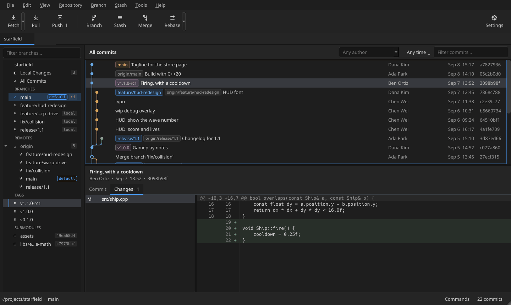
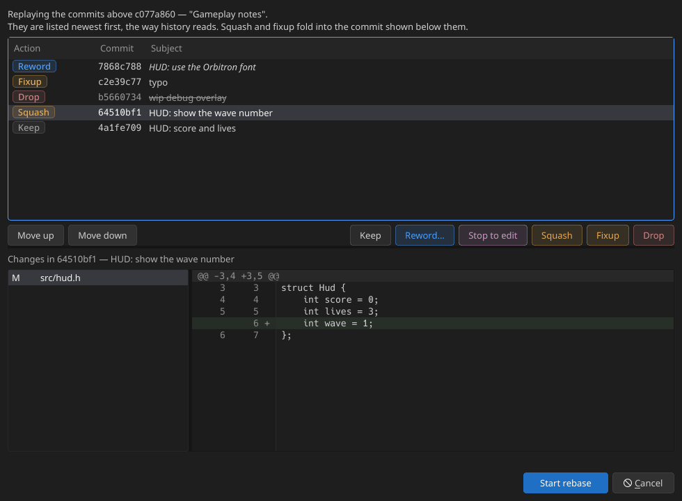
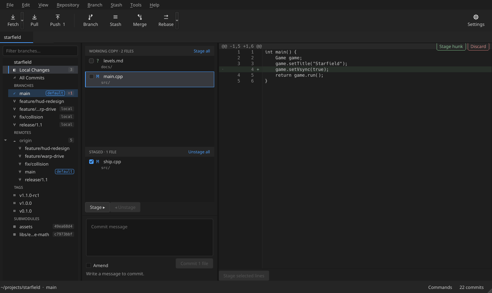
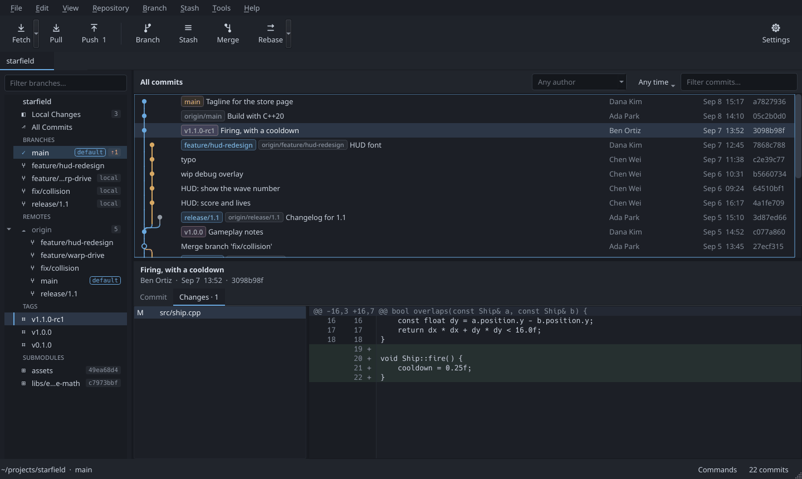
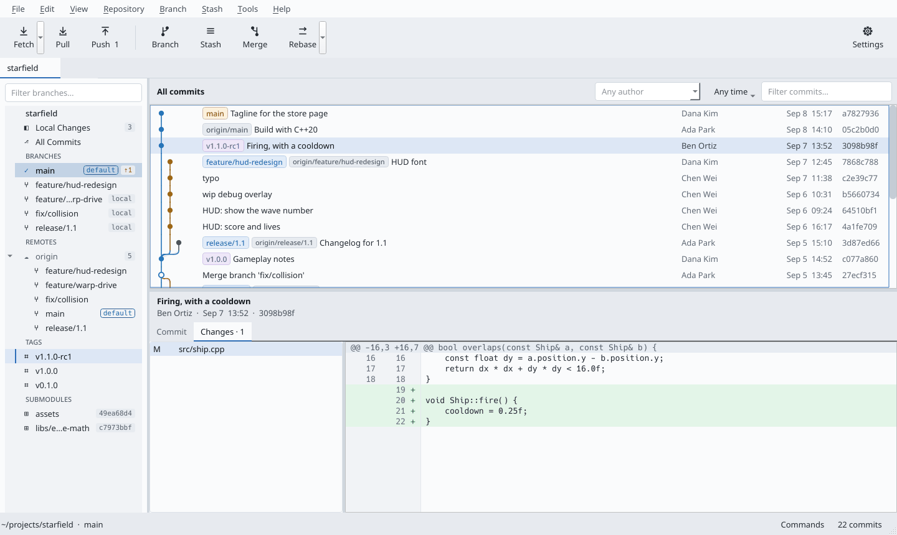
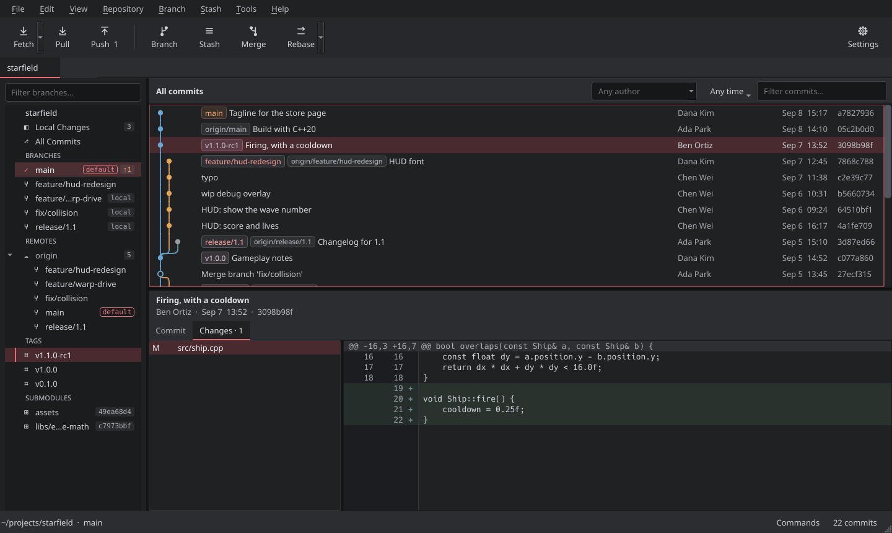

# Gity

A cross-platform Git client in C++20 and Qt 6, for Linux, macOS and Windows.



> [!WARNING]
> **Gity is early and largely untested.** It has been used by one person, mostly on Linux, against
> a handful of repositories — and it runs real git commands on real repositories: commits,
> rebases, resets, force pushes. Use it at your own risk, keep backups of work you cannot lose, and
> try it on a copy of a repository before trusting it with one that matters. As the
> [licence](LICENSE) says, it comes with no warranty of any kind.
>
> Most actions can be undone (Edit ▸ Undo), and pull, merge, rebase and push are previewed before
> they run — but those safety nets are themselves new code.

## Why it exists

Some of the most polished desktop Git clients — Fork, for one — are made only for macOS and
Windows. Gity sets out to fill that gap on Linux, while running on all three.

Gity is an independent project. It is not affiliated with or endorsed by Fork or its authors, and
contains no code from it or from any other Git client. Product names are used only to describe that
gap, and belong to their owners.

## How it was made

Gity was written mostly by **vibe coding with [Claude](https://www.anthropic.com/claude)**, through
Claude Code. Its author decided what to build, set the design and the rules in
[ARCHITECTURE.md](ARCHITECTURE.md), tried each feature and reported what was wrong; Claude wrote
most of the code, the tests and the documentation, and fixed what was found.

That is part of why the warning above matters. The code has unit tests and a strict
warnings-as-errors build, and many features were checked in the running app — but it has not had
the line-by-line human review that long-lived hand-written projects get. Read it, and report what
you find, with that in mind.

## What it does

**Safety first**

* **Nothing is lost.** Commits, merges, rebases, resets, checkouts, deleted branches and tags,
  dropped stashes, discards and pulls can all be undone (Ctrl+Z) and redone (Ctrl+Shift+Z). Gity
  snapshots branches, tags, stashes and the working copy — untracked files included — as ordinary
  git objects, and an undo never moves a branch that has changed since, so work done afterwards,
  even in a terminal, is kept.
* **You see what will happen first.** Pull, merge, rebase and push open a preview: commits coming in
  and going out, fast-forward or not, the files a trial merge says would conflict, and anything
  uncommitted that would stop git. Force push is only ever `--force-with-lease`, and asks twice on
  shared branches like `main`.
* **Git is never hidden.** Every button names the git command behind it, and the command log
  (View ▸ Command Log) lists everything Gity runs, as you could type it yourself.

**History**

* A fast, custom-painted commit graph — on a 13,000-commit production project, the first rows paint
  in 54 ms.
* Filter by text, author and date range; compare two branches by Ctrl-clicking them.
* Branches, remotes, tags, stashes and submodules in a sidebar. The current branch stands out, the
  remote's default branch is marked, any branch — local or remote — can be pinned to the top, and a
  branch whose remote copy was deleted is flagged.

**Changes**

* Stage by file, hunk or line; discard, stash or copy several files at once.
* Commit and amend, with the reason shown whenever Commit is disabled.

**Branches and history editing**

* Checkout and new branch ask what to do with uncommitted changes — keep, stash and reapply, or
  discard — and bring submodules along.
* Merge, cherry-pick, revert, reset, stash, and plain and interactive rebase — with reword, squash,
  fixup, drop, and stop-to-edit in Local Changes.

**Working with remotes**

* Fetch (submodules included), pull, push and clone, with progress. Every network command runs
  through your own `git`, so your credential helper, SSH agent, LFS and hooks behave as they do in a
  terminal.
* Open a pull or merge request page on GitHub, GitLab, Bitbucket, Gitea or Azure DevOps.
* LFS locks, shown on the files they cover, with lock and unlock in place.

**More**

* **Submodules are repositories**, each opened in its own tab.
* **Image diffs** — side by side, difference and onion skin.
* **Credentials without storing any.** Gity uses your git credential helper and GitHub CLI, can
  show and remove what they hold, and can pin a repository to one account.
* **Picks up where you left off** — open tabs come back at start-up, and recent repositories are on
  File ▸ Open Recent.

### Appearance

View ▸ Theme, or Settings ▸ Appearance:

| Theme | Look |
|---|---|
| **System** | Navy Dark or Navy Light, following the desktop's light or dark setting |
| **Gity Dark** · **Gity Light** | Neutral greys and a plain blue accent |
| **Navy Dark** · **Navy Light** | Slate-tinted greys — the original design |
| **Midnight** | Navy Dark with deeper surfaces, for a dark room |
| **Ember Steel Dark** | Smoked graphite, silver text, soft red accents |
| **Crimson Steel** | Carbon black, steel greys, blood-red selection and crimson actions |

History rows can be Comfortable or Compact (View ▸ History Rows). Every theme keeps text at 4.5:1
contrast or better, and colour is never the only signal: states also carry a word or a shape.
[GityDesign/THEMES.md](GityDesign/THEMES.md) has the details.

## Screenshots

From a sandbox project — the people and the game in them are made up.

**Interactive rebase** — each action coloured by how much it changes, with the selected commit's
changes underneath.



**Local changes** — one file staged, one edited, one new.



**Themes** — four of the seven.

| Gity Dark | Navy Dark |
|---|---|
|  |  |
| **Navy Light** | **Ember Steel Dark** |
|  |  |

## Status

* **Linux is the only platform used day to day.** macOS and Windows build in CI, on demand, but
  neither has been used in earnest.
* **No release builds yet** — build from source. Nothing is signed.
* What is planned, and what most needs testing, is in [ROADMAP.md](ROADMAP.md).

## Building

You need CMake 3.24 or later, Ninja, a C++20 compiler, Qt 6.8 or later, libgit2 1.7 or later, and
GoogleTest. At run time Gity uses the `git` on your system, 2.30 or later (2.38 or later for merge
previews).

| Platform | Dependencies |
|---|---|
| Linux | `qt6-base-dev libgit2-dev libgtest-dev ninja-build` — or Qt from the official installer if your distribution's is older than 6.8 |
| macOS | `brew install ninja qt@6 libgit2 googletest` |
| Windows | Qt from the official installer; libgit2 and GoogleTest from vcpkg |

```bash
cmake --preset dev && cmake --build --preset dev && ctest --preset dev
./build/dev/src/app/gity
```

Presets: `dev` (RelWithDebInfo), `dev-asan` (with address and undefined-behaviour sanitizers),
`release`, `ci` (warnings are errors) and `ci-headless` (`src/core` alone, without Qt).
`cmake --install` and CPack are described in [packaging/README.md](packaging/README.md).

**Qt Creator** opens the project directly — open the top-level `CMakeLists.txt`, and the presets
appear as build configurations. If more than one Qt is installed, pick one and stay on it, or the
command-line and IDE builds keep invalidating each other.

**Benchmark.** `gity-bench /path/to/repo` times the history walk, lane assignment, status and diff
on a repository; `tools/make-bench-repo.sh N DIR` generates synthetic history to try it on.
Results so far are in [ARCHITECTURE.md](ARCHITECTURE.md#measurements).

## Documentation

| File | What is in it |
|---|---|
| [ARCHITECTURE.md](ARCHITECTURE.md) | The decisions that shape the code, and why — read this before changing anything large |
| [ROADMAP.md](ROADMAP.md) | What is still open |
| [CONTRIBUTING.md](CONTRIBUTING.md) | How to build, test and send changes, and the traps worth knowing |
| [SECURITY.md](SECURITY.md) | How to report a vulnerability, and what Gity does with credentials |
| [CHANGELOG.md](CHANGELOG.md) | What changed, release by release |
| [GityDesign/](GityDesign/README.md) | Design tokens, themes and the visual specification |
| [THIRD_PARTY_NOTICES.md](THIRD_PARTY_NOTICES.md) | Third-party components and their licences |

## Contributing

Bug reports and pull requests are welcome — see [CONTRIBUTING.md](CONTRIBUTING.md) and the
[code of conduct](CODE_OF_CONDUCT.md). Please report security problems privately, as
[SECURITY.md](SECURITY.md) describes.

## Licence

MIT — see [LICENSE](LICENSE). Provided as is, without warranty.

Gity links Qt 6 under the LGPL and libgit2 under GPLv2 with a linking exception, and runs your
system's `git`. [THIRD_PARTY_NOTICES.md](THIRD_PARTY_NOTICES.md) lists every third-party component,
its licence, and what a binary package must include.
